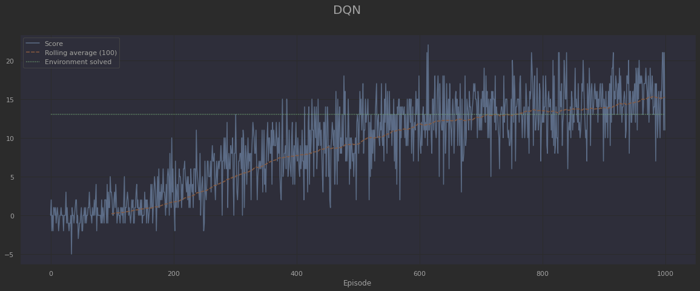

# Deep Reinforcement Learning Nanodegree

This repository contains my **Deep Reinforcement Learning** solution to one of 
the stated problems within the scope of the following Nanodegree:

[Deep Reinforcement Learning Nanodegree Program - Become a Deep Reinforcement Learning Expert](https://www.udacity.com/course/deep-reinforcement-learning-nanodegree--nd893)

Deep Reinforcement Learning is a thriving field in AI with lots of practical 
applications. It consists of the use of Deep Learning techniques to be able to
solve a given task by taking actions in an environment, in order to achieve a 
certain goal. This is not only useful to train an AI agent so as to play videogames, 
but also to set up and solve any environment related to any domain. In particular, 
as a Civil Engineer, my main area of interest is the **AEC field** (Architecture, 
Engineering & Construction).

## Navigation Project

This project consists of a Navigation problem, which is contained within the Value 
Based Methods chapter and is solved by means of Deep Q Learning algorithms.

### Environment description

The environment used for this project is based on the *Unity ML-Agents* Banana Collector 
environment from 2018. Nonetheless, the updated corresponding equivalent in 2022 
would be the
[Food Collector Environment](https://github.com/Unity-Technologies/ml-agents/blob/main/docs/Learning-Environment-Examples.md#food-collector).

It consists of a square playground in which there exist 
both yellow and blue bananas. An agent must then pick the yellow ones, while discarding
the blues.

 

Its characteristics are as follows:
- The state space has 37 dimensions and contains the agent's velocity, along with 
ray-based perception of objects in front of it.
- The action space consists of 4 discrete actions. Namely: move forward, move 
backward, turn left and turn right.
- A reward of +1 or -1 is provided when a yellow or blue banana is collected, 
respectively. 

### Solution

The code is structured with the *PyTorch* Deep Neural Networks on *model.py*, the 
agent logics on *agent.py* and the environment setup on *environment.py*. All of it
is structured pythonically, in an OOP fashion, and is often self explanatory. 
Lastly, the Jupyter Notebook *Navigation.ipynb* builds up an interface to train agents 
according to several variations of the Deep Q Learning algorithm, as well as to 
visualize the corresponding results with *pandas DataFrames* and *Seaborn* plots.

#### Deep Q Learning
This is the vanilla Deep Q Learning algorithm, as firstly
[introduced by the DeepMind team in 2013](https://doi.org/10.48550/arXiv.1312.5602), 
which was able to solve Atari games.

#### Double Deep Q Learning
Deep Q Learning is known to be prone to overestimate its action values, specially 
at early learning stages. For this reason, this variant tackles that issue by 
selecting the best action using one Deep Neural Network, but evaluating it using a 
different one. This makes the evolution of action values more stable and hence, 
learning is more robust.

#### Prioritized Experience Replay
This algorithm changes the sampling of the Memory Replay buffer from uniformly 
distributed to favour those state-actions that have triggered the highest 
Temporal Difference Error. This way, the agent can learn more frequently from those 
state-actions it still isn't sure about. One of the drawbacks is that depending on 
the implementation details, this algorithm can be much slower than uniform sampling. 
Moreover, if the hyperparameters are not correctly tweaked, it can suffer from 
instability issues.

#### Dueling Deep Q Learning
In this variant of the algorithm, the neural networks are divided into two streams.
One of them accounts for the state value, whereas the other one accounts for the 
advantage of taking the possible actions. Both streams are combined before 
outputting the Q value for each action at the last layer. Due to its architecture, 
this algorithm helps to better generalize learning across actions.

#### All of the above
Lastly, an agent is trained in the environment using Double Deep Q Learning, 
Prioritized Experience Replay and Dueling Deep Q Learning, all at once.

#### Comparison of the different algorithms

The following chart shows the number of episodes which was needed to solve the 
environment, for each of the implemented algorithms:

Needless to say, this is not a thorough comparison, since only one run is 
included, and only up to 1000 episodes. Even so, this has been a very interesting 
exercise in order to further understand the dynamics of the Deep Q Learning 
algorithm and three of its variants.

Both from the chart and from the previous training plots, it can be seen that 
for this particular environment, and in order to reach an average of 13 points 
per episode over 100 episodes, there has not been much of a difference. However, 
it must be noted that the slope of the rolling average score is gentle, and being
a problem of stochastic nature, its intersection with the horizontal line at 13 
points can greatly vary across different runs. Perhaps if the objective was set 
higher than 13 points, and a longer training was needed, the differences between 
them would more easily arise.

In any case, one of the most obvious distinguishing elements has been the needed
amount of time for Prioritized Experience Replay. The forward pass needed for each 
step in order to add the Temporal Difference error to the Memory Replay buffer has 
undoubtedly slowed down the training. However, this could be more efficiently 
implemented, for instance by using multiprocessing, or by making a buffer of 
experiences which was then jointly passed to the GPU. The latter would be worse 
per step, but probably better per unit of time spent.

### Ideas for a next step

In order to improve future performance, the following elements could be explored:

- Longer training runs (more than 1000 episodes)
- Hyperparameter tweaking (learning rate, epsilon decay, etc.)
- Other variants of the Deep Q Learning algorithm, such as multi-step bootstrap 
targets, distributional DQN or noisy DQN.

